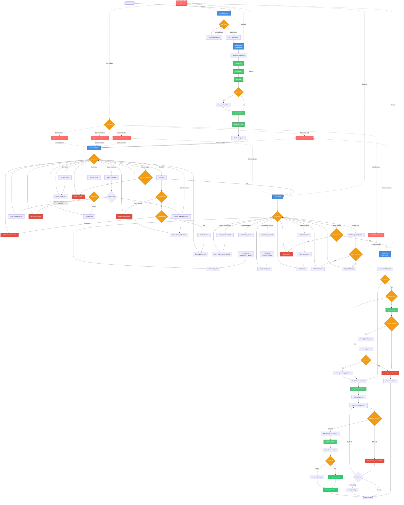

# Doheny Surf Desk - Surf School Booking Agent

A voice-based surf lesson booking system demonstrating **background observer agents**, **typed tasks**, and **task groups** using LiveKit Agents.

## What This Demo Shows

This example demonstrates three key patterns:

### 1. Background Observer Agent (The Main Focus)

The **ObserverAgent** runs in parallel with the main conversation flow and demonstrates how to:

- **Monitor conversations in the background** without interrupting the user experience
- **Inject context and hints** directly into the active agent's conversation
- **Use slower, more capable LLM models** since analysis is not real-time blocking
- **Perform background research**: check customer profiles, analyze world state, run custom validation logic
- **Add guardrails and compliance checks** that operate independently of the main flow

**Why this matters:** The observer doesn't block the conversation - it can take several seconds to deeply analyze safety, compliance, or custom business logic, then inject guidance into the active agent's context. This enables using more powerful reasoning models without adding latency to the user experience.

### 2. Sequential Task Groups

Shows how to execute multiple tasks in sequence with structured return values using `TaskGroup` (added in LiveKit Agents 1.3).

For more information, see the [LiveKit Agents documentation](https://docs.livekit.io/agents/).

### 3. Typed Tasks with Structured Results

Demonstrates tasks that return structured data objects instead of strings, making it easier to extract and use results programmatically.

## Agent Overview

The system includes five main agents and one parallel observer:

1. **FrontDeskAgent** - Greets customers and routes them to booking or provides consultation
2. **IntakeAgent** - Collects customer profile through sequential TaskGroup (5 tasks)
3. **SchedulerAgent** - Books lesson time slots with instructor availability
4. **GearAgent** - Recommends surfboard and wetsuit based on measurements
5. **BillingAgent** - Processes payment and sends confirmation via tasks
6. **ObserverAgent** (Background) - Monitors for safety/compliance and injects context

## Key Features Demonstrated

### 1. Typed Tasks with Structured Results

Tasks complete with structured return values instead of strings:

```python
# ConsentTask returns structured data
consent_result = await ConsentTask(chat_ctx=self.chat_ctx)
if consent_result.approved:
    print(f"Guardian: {consent_result.guardian_name}")

# NotificationTask returns delivery status
notification_result = await NotificationTask(chat_ctx=self.chat_ctx)
if notification_result.delivered:
    print(f"Sent via {notification_result.channel}")
```

### 2. Sequential Task Groups

The IntakeAgent uses `TaskGroup` (added in LiveKit Agents 1.3) to execute 5 tasks sequentially:

```python
task_group = TaskGroup()
task_group.add(lambda: NameTask(), id="name_task")
task_group.add(lambda: PhoneTask(), id="phone_task")
task_group.add(lambda: AgeTask(), id="age_task")
task_group.add(lambda: GetEmailTask(), id="email_task")
task_group.add(lambda: ExperienceTask(), id="experience_task")

results = await task_group
# Access results by task ID
name = results.task_results["name_task"].name
```

### 3. Parallel Observer with Context Injection

The **ObserverAgent** is the highlight of this demo. It runs in parallel with the main conversation and uses LLM-based evaluation to detect safety issues:

**How it works:**

1. **Listens to conversation events** in the background
2. **Evaluates every 3 transcript segments** using an LLM for intelligent analysis
3. **Detects issues using LLM judgment** (not keyword matching):

   - Minor detected (customer under 18)
   - Injury mentions
   - Weather/safety concerns
   - Skill/location mismatches (e.g., beginner wanting advanced spot)
   - VIP customer detection (special promotions)

4. **Injects guardrail hints directly** into the active agent's chat context as system messages
5. **Agent naturally sees hints** and takes appropriate action

**Why LLM-based evaluation?**

- Understands context and nuance (not just keywords)
- Detects implicit mentions (e.g., "still in school" → minor)
- Fewer false positives
- Can reason about combined factors
- Same pattern as test framework's `.judge()` function

**Example Observer Flow:**

```python
# Observer evaluates conversation with LLM
eval_result = await self._evaluate_with_llm()

# If minor detected, inject hint into active agent
if eval_result.minor_detected:
    await self._send_guardrail_hint(
        severity="CRITICAL",
        trigger="Minor detected",
        hint="Customer appears to be under 18. Ensure ConsentTask runs before payment."
    )
```

The hint is injected as a system message into the current agent's chat context, so the agent sees it naturally and responds appropriately.

## Complete System Flow Diagram



## Prerequisites

- Python 3.10+
- `livekit-agents>=1.3.0`
- LiveKit account

**Note:** This example uses [LiveKit Cloud](https://cloud.livekit.io) which provides hosted AI inference (STT, LLM, TTS) without requiring additional API keys for third-party providers.

[TODO: Add more details about LiveKit Cloud setup]

## Installation

1. Clone the repository

2. Install dependencies:

   ```bash
   pip install -r requirements.txt
   ```

3. Create a `.env` file with your LiveKit credentials:
   ```env
   LIVEKIT_URL=your_livekit_url
   LIVEKIT_API_KEY=your_api_key
   LIVEKIT_API_SECRET=your_api_secret
   ```

## Running the Agent

```bash
cd complex-agents/doheny-surf-desk
python agent.py dev
```

Connect via the LiveKit Playground or a frontend client.

## Project Structure

```
doheny-surf-desk/
├── agent.py                    # Main entrypoint
├── agents/
│   ├── base_agent.py           # BaseAgent with handoff logic
│   ├── frontdesk_agent.py      # Consultation and routing
│   ├── intake_agent.py         # Profile collection (task-based)
│   ├── scheduler_agent.py      # Booking management
│   ├── gear_agent.py           # Equipment recommendations
│   ├── billing_agent.py        # Payment & finalization (task-based)
│   └── observer_agent.py       # Parallel guardrails (LLM-based)
├── tasks/
│   ├── name_task.py            # Name collection
│   ├── phone_task.py           # Phone with confirmation
│   ├── age_task.py             # Age + minor detection
│   ├── email_task.py           # Email validation
│   ├── experience_task.py      # Experience level
│   ├── consent_task.py         # Guardian consent for minors
│   ├── payment_details_task.py # Credit card collection
│   └── notification_task.py    # SMS/email confirmation
├── tools/
│   ├── calendar_tools.py       # Mock availability
│   ├── tide_tools.py           # Mock surf conditions
│   └── payment_tools.py        # Mock payment processing
├── prompts/
│   └── *.yaml                  # Agent instructions
├── mock_data.py                # Mock validators & responses
└── utils.py                    # Helper functions
```

## Observer Agent Deep Dive

The **ObserverAgent** is the most interesting component of this demo. It demonstrates a powerful pattern: **running a parallel agent that monitors and enriches the main conversation without blocking it**.

### Why Use a Background Observer?

**Traditional approach:** All logic runs in the main agent, blocking the conversation.

**Observer pattern:**

- Main agent handles conversation in real-time (fast, responsive)
- Observer runs analysis in parallel (can be slow, can use powerful models)
- Observer injects findings into main agent's context when ready
- User never waits for the background analysis

**Use cases:**

- **Safety & compliance monitoring** (this demo)
- **Customer profile enrichment** - look up purchase history, preferences, risk scores
- **Real-time fraud detection** - analyze patterns across multiple conversations
- **Contextual research** - fetch relevant knowledge base articles, check inventory
- **Multi-agent coordination** - one observer managing multiple conversation agents

### Using More Powerful Models

Since the observer doesn't block the user, you can use slower but more capable models:

```python
# Main agent: Fast model for real-time conversation
main_agent_llm = "fast-model"  # ~500ms response

# Observer: Powerful model for deep analysis
observer_llm = "reasoning-model"  # Several seconds, but doesn't block user
```

The observer can take several seconds to deeply analyze a conversation for safety issues, then inject a hint - the user never notices because they're still talking to the main agent.

**In this demo:** We use a fast model for cost-effectiveness during development. In production, you could use more sophisticated reasoning models without impacting user experience.

### How It Works in Detail

### Architecture

```python
class ObserverAgent:
    def __init__(self, session, llm):
        self.session = session  # Reference to active session
        self.llm = llm          # LLM for evaluation
        self.conversation_history = []
        self._setup_listeners()  # Listen to conversation events
```

### Event Listening

```python
@self.session.on("conversation_item_added")
def conversation_item_added(event):
    # Fires when user completes a turn
    self.conversation_history.append(event.item)

    # Evaluate every 3 segments (balance latency vs cost)
    if len(new_segments) >= 3:
        asyncio.create_task(self._evaluate_with_llm())
```

### LLM-Based Evaluation

Instead of keyword matching, the Observer uses LLM to understand context:

```python
async def _evaluate_with_llm(self):
    # Build prompt with conversation excerpt
    eval_prompt = f"""Analyze this conversation for safety issues:
    1. Minor detection (under 18)
    2. Injury mentions
    3. Weather concerns
    4. Skill mismatches
    5. VIP customers (special promotions)

    Conversation: {conversation_text}
    Current user data: {userdata_summary}

    Return JSON: {{"minor_detected": bool, ...}}
    """

    # Call LLM
    response = await self.llm.chat(eval_prompt)
    eval_result = json.loads(response)

    # Process results
    await self._process_eval_result(eval_result)
```

### Context Injection

When an issue is detected, the Observer injects a hint directly into the active agent's context:

```python
async def _send_guardrail_hint(self, severity, trigger, hint):
    # Get current active agent
    current_agent = self.session.current_agent

    # Copy and modify chat context
    ctx_copy = current_agent.chat_ctx.copy()
    ctx_copy.add_message(
        role="system",  # System messages have priority
        content=f"[GUARDRAIL ALERT - {severity}]: {trigger}\n\n{hint}"
    )

    # Update agent's context
    await current_agent.update_chat_ctx(ctx_copy)
```

The agent sees the hint naturally in its conversation flow and responds appropriately (e.g., asks for guardian consent, offers alternative surf spots, applies discounts).

### Why This Pattern Works

**Separation of concerns:**

- Main agent: Fast, responsive, handles conversation flow
- Observer: Slow, thoughtful, handles analysis and validation
- User experience: Never blocked by background processing

**Enables powerful capabilities:**

- Use slower reasoning models without latency penalty
- Perform database lookups, API calls, complex calculations in background
- Run multiple validations in parallel
- Check compliance rules without slowing down conversation
- Enrich context with external data (CRM, inventory, knowledge base)

**Practical advantages:**

- **Non-intrusive**: Observer doesn't take control, just provides guidance
- **Context-aware**: Uses LLM to understand nuance and implicit mentions
- **Flexible**: Can detect any pattern you can describe in natural language or implement in code
- **Scalable**: Same observer can monitor multiple conversation agents simultaneously
- **Testable**: Observer logic is isolated and easy to test independently

**Real-world applications:**

- E-commerce: Check inventory, apply dynamic pricing, detect fraud patterns
- Healthcare: Verify insurance, check drug interactions, ensure compliance
- Finance: Real-time risk assessment, regulatory compliance, pattern detection
- Customer service: Look up account history, check service status, route intelligently

## Notes

- All data is **mock** - no real database or external APIs
- Payment has 90% success rate for testing error handling
- Observer evaluates every 3 transcript segments to balance cost/latency
- This is a **demonstration** showcasing patterns, not production-ready code
